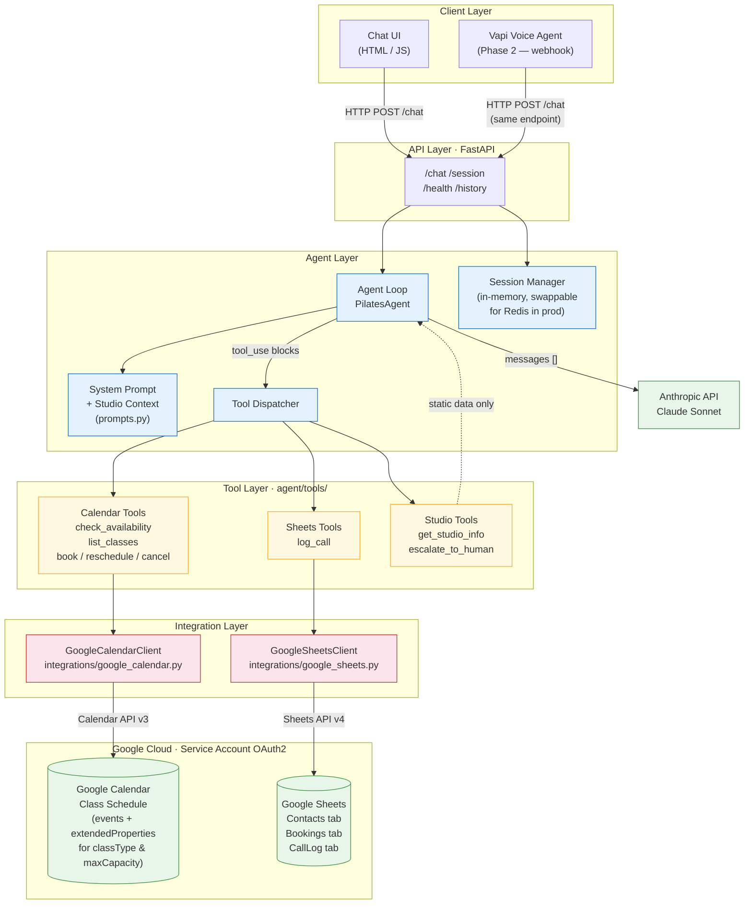

# Solstice Pilates — AI Receptionist Architecture

## System Overview



---

## Data Flow — Booking a Class

```
Caller:  "Book me into the 7pm Reformer on Thursday"

1. POST /chat  →  FastAPI  →  PilatesAgent.chat()
2. Agent adds message to session history
3. Calls Anthropic API  →  Claude returns tool_use: check_class_availability
4. Tool: GoogleCalendarClient.find_class_event("reformer", "2025-06-05", "19:00")
         GoogleSheetsClient.get_booking_count(event_id)   → 7 / 10 booked
5. Claude sees 3 spots → asks caller for name + phone
6. Caller provides info  →  Claude returns tool_use: book_class
7. Tool: GoogleSheetsClient.create_booking(...)           → booking_id = "A1B2C3D4"
         GoogleSheetsClient.upsert_contact(phone, name)   → CRM updated
8. Claude confirms booking; conversation ends
9. Claude returns tool_use: log_call
10. Tool: GoogleSheetsClient.log_call(...)                → CallLog row written
11. Final text response returned to caller
```

---

## Key Design Decisions

| Decision | Choice | Reason |
|---|---|---|
| LLM | Anthropic Claude (claude-sonnet-4-6) | Reliable tool_use, clean stop_reason API |
| Capacity tracking | Sheets Bookings tab, not Calendar attendees | Avoids email requirements; auditable |
| Session state | In-memory dict | Simple for Phase 1; swap key for Redis in prod |
| Auth | Google Service Account | No user-flow needed for a server-side app |
| Phase 2 extension | Same `/chat` POST endpoint | Vapi webhook hits the same route — no changes to agent |
| Escalation | `escalate_to_human` tool | Agent decides; logged + flagged for staff callback |

---

## Phase 2: Voice Agent (Vapi)

The agent is already Phase-2 ready:

```
Vapi inbound call
    └── Vapi sends POST /chat  { session_id, message: "<transcribed speech>" }
    └── Agent replies with text
    └── Vapi reads reply aloud via TTS
```

Steps to wire up:
1. Point a Vapi Custom LLM provider at `POST /chat`
2. Configure Vapi with the studio phone number
3. Tune `max_tokens` down to ~200 for snappier spoken replies
4. Optionally add a `/vapi/end-of-call` webhook to trigger `log_call` if the caller hangs up mid-session

No agent code changes required.

---

## Project Structure

```
solstice_pilates/
├── agent/
│   ├── agent.py          # PilatesAgent: loop + tool dispatch + session
│   ├── prompts.py        # System prompt (injected fresh each turn)
│   └── tools/
│       ├── calendar_tools.py   # Anthropic tool schemas — calendar ops
│       ├── sheets_tools.py     # Anthropic tool schema — log_call
│       └── studio_tools.py     # Anthropic tool schemas — info + escalate
├── integrations/
│   ├── google_calendar.py     # Calendar API client
│   └── google_sheets.py       # Sheets API client (Contacts / Bookings / CallLog)
├── api/
│   └── routes.py         # FastAPI: /chat  /session  /health
├── config/
│   ├── settings.py       # Pydantic-settings from .env
│   └── studio_info.py    # Static studio info dict
├── ui/
│   └── index.html        # Minimal Phase-1 chat UI
├── scripts/
│   └── setup_fixtures.py # Populates Calendar + Sheet for testing
├── tests/
│   └── test_agent.py     # Unit tests (offline, mocked)
├── credentials/          # Git-ignored; put service_account.json here
├── architecture.md       # This file
├── main.py               # App entry point (uvicorn)
├── requirements.txt
└── .env.example
```
